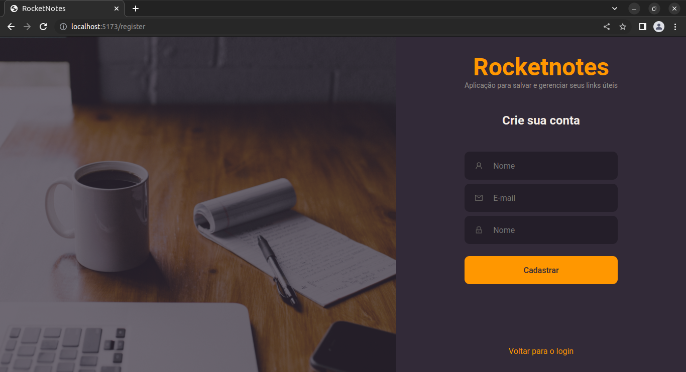
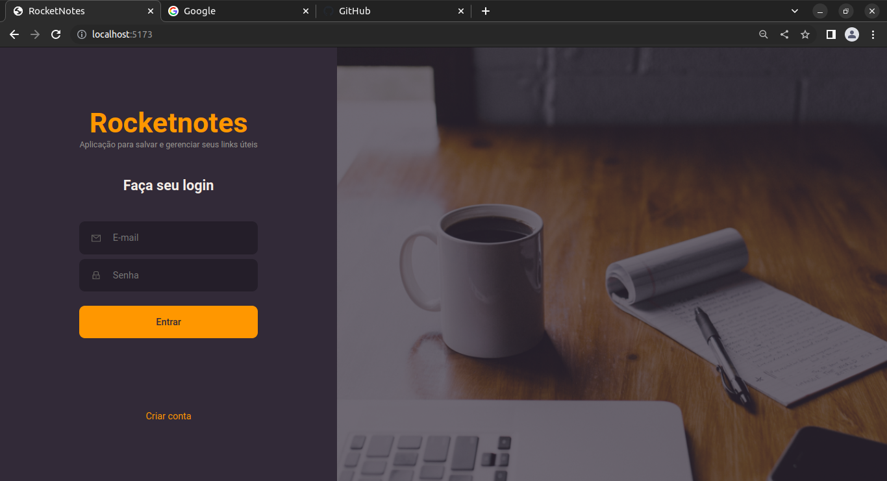
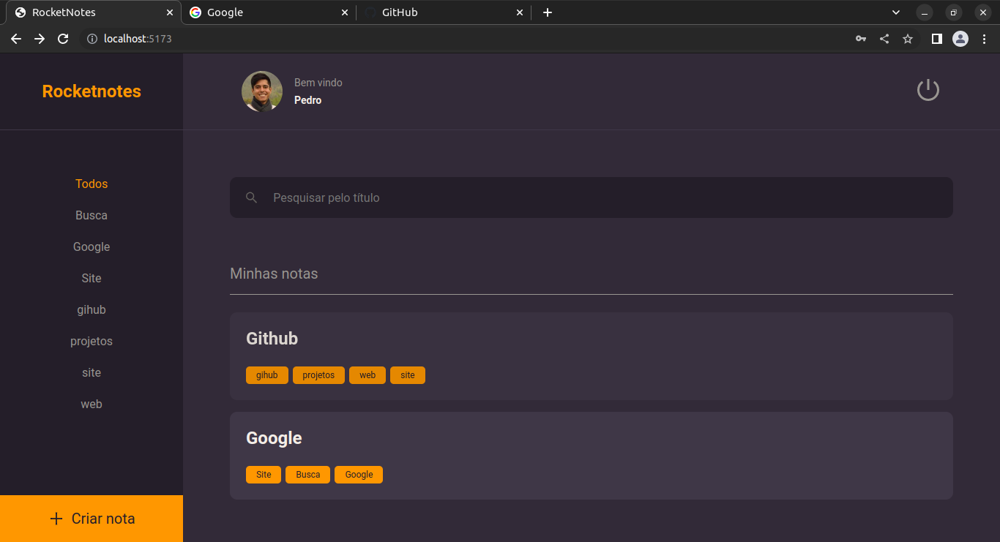
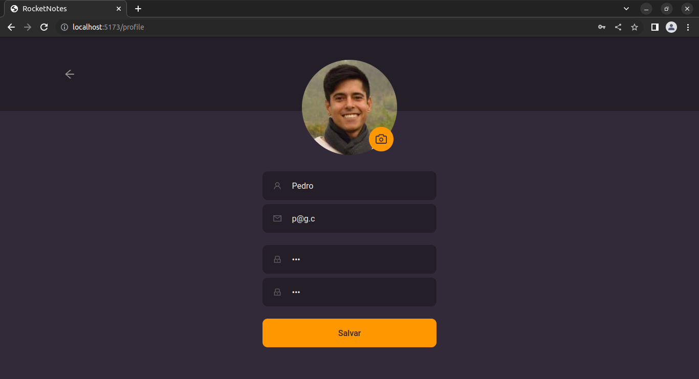
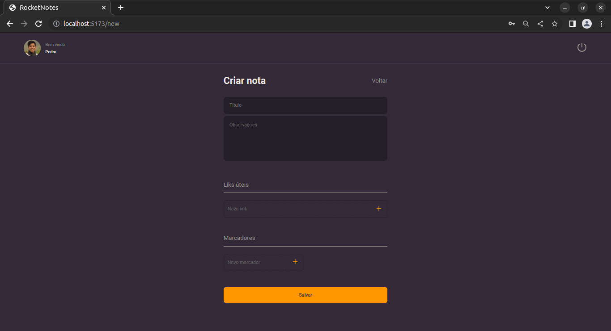
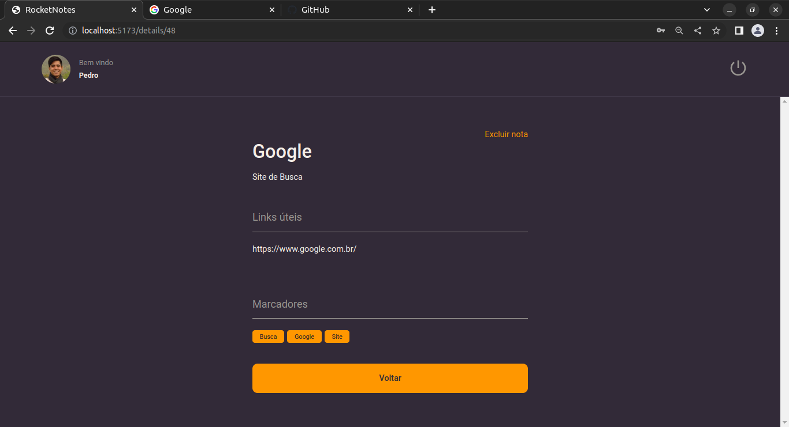

# RocketNotes

- [RocketNotes](#rocketnotes)
  - [Apresentation](#apresentation)
  - [Primeiros passos](#primeiros-passos)
  - [Páginas](#páginas)
    - [SignUp](#signup)
    - [SignIn](#signin)
    - [Home](#home)
    - [Profile](#profile)
    - [New](#new)
    - [Details](#details)
  - [Componentes](#componentes)
    - [Button](#button)
    - [ButtonText](#buttontext)
    - [Header](#header)
    - [Input](#input)
    - [Note](#note)
    - [NoteItem](#noteitem)
    - [Section](#section)
    - [Tag](#tag)
    - [TextArea](#textarea)

<small><i><a href='http://ecotrust-canada.github.io/markdown-toc/'>Table of contents generated with markdown-toc</a></i></small>


## Apresentation

Fronted para aplicação WEB para salvar notas e links úteis

- Desenvolvido em ReactJS v18.2.0;
- Ambiente de desenvolvimento construído com Vite v4.0.0;
- Préprocessador de CSS StyledComponents v5.3.6;
- Requisições HTTP com Axios v1.2.6;

## Primeiros passos

- [Diretorio do Gihub](https://github.com/pedromsra/rocketnotes_frontend);
- Seguir os passos do link [Clonar um repositório](https://docs.github.com/pt/repositories/creating-and-managing-repositories/cloning-a-repository) para realizar o **git clone** da aplicação;
- Para os fins desse projeto será considerado que o [servidor local](http://localhost:5173) (padrão do vite);
- Abrir o terminal e digitar:
  - `$ cd /local_da_pasta_onde_a_aplicação_foi_salva`
  - `$ npm install`
  - `$ npm run dev`

## Páginas

Segue a imagens das páginas utilizadas nessa aplicação.

> Os componentes podem ser identificados nas imagens.

### SignUp



### SignIn



### Home



### Profile



### New



### Details



## Componentes

> A documentação dos componentes irá cubrir a utilização dos componentes, qualquer personalização deverá ser realizada no arquivo "/src/assets/"componente"/styles.js" para cores, tipos e dimensões personalizadas. 

> No geral, os componentes recebem props como onClick = {...}, etc. 

### Button

- Descrição: Botão simples em caixa;
- Aplicação:

```html
    <Button title="Meu botão" isActive = "false" />
```

- Comentário:
  - Se o título não for informado, o botão irá aparecer em branco;
  - Em caso de ```isActive = "true"``` irá aparecer, no lugar do título, a palavra "loading...";

### ButtonText

- Descrição: Texto clicável, com função de input ```type = button```;
- Aplicação:

```html
    <ButtonText title="Meu botão" />
```

- Comentário:
  - Se o título não for informado, o botão irá aparecer em branco;

### Header

- Descrição: Navbar com imagem do usuário e botão para logout;
- Aplicação:

```html
    <Header />
```

- Comentário: não é necessário props;

### Input

- Descrição: input html usado para type = text, permite adicionar icone;
- Aplicação:

```html
    <Input icon = {myIcon} placeholder="My input" type = "text" />
```

- Comentários: é essencialmente um ```<input />```;

### Note

- Descrição: cria um resumo de uma nota a ser exibida na página Home;
- Aplicação:

```html
    <Note key={String(note.id)} data={note} />
```

- Comentário: note é um objeto que contem uma nota com seu respectivo título e tags, que serão exibido no Note a ser criado;

### NoteItem

- Descrição: Link ou Tag criado ou a ser criado de uma nota, com sua aparencia mudando de acordo com sua condição de novo ou saldo;
- Aplicação:

```html
    <NoteItem isNew placeholder = "Novo marcador" />
```

### Section

- Descrição: Título de sessão, como Liks úteis ou Marcadores, apresenta-se com uma linha abaixo do nome;
- Aplicação: 

```html
    <Section title = "Liks úteis">
        {childrens}
    </Section>
```

- Comentário: 
  - o title irá definir o nome que irá aparecer;
  - O childrens é a informação que pode ser adicionada dentro da Section, como os Links ou Tags a serem salvos;

### Tag

- Descrição: Tag que irá aparecer na página detalhada da nota e no resumo da nota, na página Home;
- Aplicação:

```html
    <Tag key = {tag.id} title={tag.name} />
```

- Comentário: A props key é obrigatória, uma vez que haja mais de uma Tag para uma Nota.

### TextArea

- Descrição: Input text área;
- Aplicação:

```html
    <TextArea placeholder = "Observações" />
```